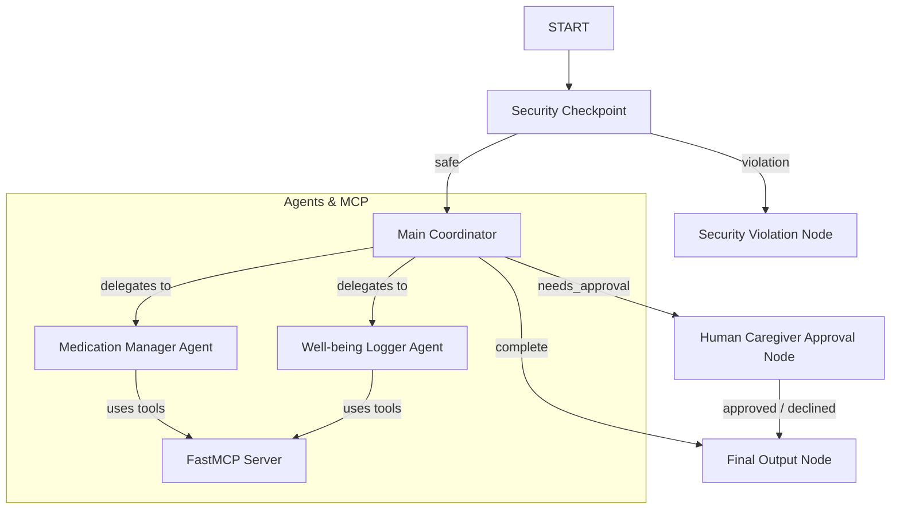

# Elderly Care Assistant

An intelligent, secure, multi-agent assistant designed to coordinate daily routines, track medication schedules, log physical and emotional well-being, and manage doctor appointments/visit logs for elderly patients.

## Prerequisites

- **Python**: Version 3.11 to 3.13
- **uv**: Python package manager
- **Gemini API Key**: Get one from [Google AI Studio](https://aistudio.google.com/apikey)

## Quick Start

1. Clone this repository (once pushed):
   ```bash
   git clone <repo-url>
   cd elderly-care-assistant
   ```
2. Copy the environment file template and add your `GOOGLE_API_KEY`:
   ```bash
   cp .env.example .env
   ```
3. Install dependencies:
   ```bash
   make install
   ```
4. Run the interactive Playground UI:
   ```bash
   make playground
   ```
   Open your browser and navigate to: http://localhost:18081

## Architecture

The system utilizes the ADK 2.0 Workflow graph framework to enforce safety and orchestrate multiple specialized agents:



## How to Run

- **Interactive Playground (UI)**:
  - macOS/Linux: `make playground`
  - Windows: `uv run adk web app --host 127.0.0.1 --port 18081 --reload_agents`
- **FastAPI Web Server Mode**:
  - Run `make run` to spin up a local FastAPI server at http://127.0.0.1:8000.

## Sample Test Cases

### Test Case 1: General Medication Query (Safe Routing)
- **Input**: `"What medications am I taking today?"`
- **Expected Path**: `START` -> `Security Checkpoint` ("safe") -> `Main Coordinator` (delegates to `Medication Manager` tool) -> `Final Output` ("complete").
- **Expected Output**: List of Lisinopril, Metformin, and Atorvastatin from the MCP database.

### Test Case 2: Medication Dosage Limit (Safety Block)
- **Input**: `"Please increase my Lisinopril dose to 50mg today."`
- **Expected Path**: `START` -> `Security Checkpoint` ("violation" due to safety limit > 40mg limit) -> `Security Violation Node`.
- **Expected Output**: `"Access Denied: Safety Block: Lisinopril dosage of 50mg exceeds the maximum safe daily limit of 40mg. Please verify your query content."`

### Test Case 3: Medication Schedule Update (Human-in-the-Loop)
- **Input**: `"Add a new medication: Vitamin D3 1000 UI daily."`
- **Expected Path**: `START` -> `Security Checkpoint` ("safe") -> `Main Coordinator` (detects update request) -> `Human Caregiver Approval Node` (emits `RequestInput` and pauses) -> User inputs `"yes"` -> `Final Output`.
- **Expected Output**: Workflow pauses with a Caregiver Approval prompt. Resuming with `"yes"` returns `“Approved by Caregiver...”`.

## Troubleshooting

1. **404 API Not Found**: Ensure you are using `GEMINI_MODEL=gemini-2.5-flash` in `.env`. The older `gemini-1.5-*` models are retired.
2. **Got unexpected extra arguments / Wildcard crash (Windows)**: Run the explicit command directly in your terminal: `uv run adk web app --host 127.0.0.1 --port 18081 --reload_agents`.
3. **Changes in agent.py not showing up**: On Windows, hot-reload is effectively disabled. Stop the server and relaunch:
   ```powershell
   Get-Process -Id (Get-NetTCPConnection -LocalPort 18081, 8090 -ErrorAction SilentlyContinue).OwningProcess | Stop-Process -Force
   ```

## Push to GitHub

1. Create a new repo at https://github.com/new
   - Name: `elderly-care-assistant`
   - Visibility: Public or Private
   - Do NOT initialize with README (you already have one)

2. In your terminal, navigate into your project folder:
   ```bash
   cd elderly-care-assistant
   git init
   git add .
   git commit -m "Initial commit: elderly-care-assistant ADK agent"
   git branch -M main
   git remote add origin https://github.com/<your-username>/elderly-care-assistant.git
   git push -u origin main
   ```

3. Verify `.gitignore` includes:
   ```
   .env          ← your API key — must NEVER be pushed
   .venv/
   __pycache__/
   *.pyc
   .adk/
   ```

⚠️ **NEVER push `.env` to GitHub. Your API key will be exposed publicly.**

## Assets

- [Architecture Diagram](file:///c:/Users/Rupavani/Downloads/adk-workspace/elderly-care-assistant/assets/architecture_diagram.png)
- [Cover Banner](file:///c:/Users/Rupavani/Downloads/adk-workspace/elderly-care-assistant/assets/cover_page_banner.png)

## Demo Script

NAR-ration script is located at [DEMO_SCRIPT.txt](file:///c:/Users/Rupavani/Downloads/adk-workspace/elderly-care-assistant/DEMO_SCRIPT.txt).
