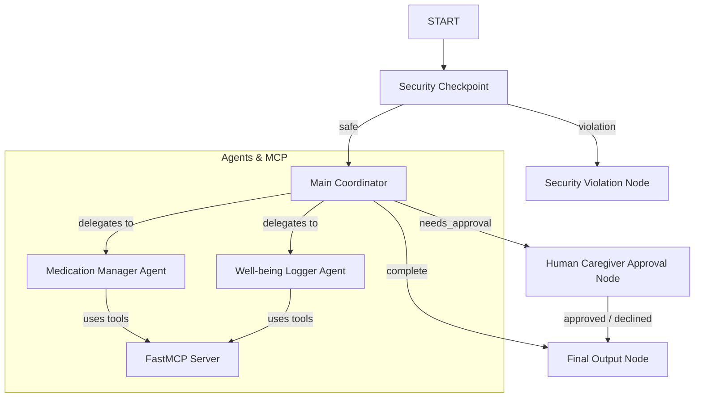

# Submission Write-Up: Elderly Care Assistant

## Problem Statement

Elderly patients often struggle to manage complex daily routines, coordinate multiple medication doses, schedule regular doctor visits, and log physical/emotional symptoms. Caregivers need a safe, automated coordinator that keeps them in the loop for critical changes (like dosage modifications) while allowing the patient to easily check schedules and record symptoms through natural conversation.

## Solution Architecture

The assistant employs a multi-agent system built on the ADK 2.0 Workflow graph. It filters incoming queries through a security checkpoint before routing them to the appropriate coordinator, pausing for caregiver approval on critical updates:

## Concepts Used

- **ADK 2.0 Workflow Graph**: Configured in [agent.py](file:///c:/Users/Rupavani/Downloads/adk-workspace/elderly-care-assistant/app/agent.py#L221) to connect nodes and model the lifecycle of the patient conversation.
- **LlmAgent**: Used for specialized sub-agents (`medication_manager`, `wellbeing_logger`) and the orchestrator (`care_coordinator`) in [agent.py](file:///c:/Users/Rupavani/Downloads/adk-workspace/elderly-care-assistant/app/agent.py#L23-L97).
- **AgentTool**: Wraps sub-agents as tools for the orchestrator, enabling seamless task delegation in [agent.py](file:///c:/Users/Rupavani/Downloads/adk-workspace/elderly-care-assistant/app/agent.py#L55-L56).
- **MCP Server**: Implemented as a standalone stdio service in [mcp_server.py](file:///c:/Users/Rupavani/Downloads/adk-workspace/elderly-care-assistant/app/mcp_server.py) to manage medication databases, logs, and upcoming doctor appointments.
- **Security Checkpoint**: Implemented in [agent.py](file:///c:/Users/Rupavani/Downloads/adk-workspace/elderly-care-assistant/app/agent.py#L104-L171) to detect prompt injection, redact PII, and check medication safety limits.
- **Agents CLI**: Project scaffolded, run, and verified using `agents-cli`.

## Security Design

1. **Prompt Injection Check**: Filters keywords like "ignore previous instructions" or "system prompt" to block jailbreak attempts.
2. **PII Scrubbing**: Redacts SSNs and phone numbers using regular expressions.
3. **Audit Log**: Outputs JSON-structured audit trails of all scans and caregiver approvals with appropriate severities (`INFO`, `WARNING`, `CRITICAL`).
4. **Dosage Limit Enforcement**: Checks inputs for medication updates and blocks any dosage requests exceeding predefined safety limits (e.g. Lisinopril > 40mg, Metformin > 2000mg).

## MCP Server Design

Exposes 6 domain-specific tools over standard input/output (stdio):
- `get_medications`: Retrieves current medication schedules.
- `log_medication_dose`: Logs that a dose was taken.
- `get_medication_logs`: Fetches administration logs.
- `get_wellbeing_history`: Fetches daily wellness checks.
- `log_wellbeing`: Records sleep, mood, pain levels, and notes.
- `get_doctor_visits`: Retrieves scheduled doctor appointments.

## HITL Flow

When a user requests to change dosage, timing, or add a medication, the `care_coordinator` flags the response. The `main_coordinator_node` routes the execution to `human_approval_node` which raises a `RequestInput` event, pausing execution. The workflow waits until a caregiver confirms the change (by typing 'yes' or 'no') before completing.

## Demo Walkthrough

1. **Ask schedule**: User asks "What are my medications today?". The request routes through `security_checkpoint` (marked safe), goes to `care_coordinator`, which calls `medication_manager`, querying `get_medications`. The output returns the list of current medicines.
2. **Overdose attempt**: User says "Increase Lisinopril to 50mg". `security_checkpoint` immediately flags a dosage limit violation, logs a warning, and blocks routing to the LLM, returning "Access Denied: Safety Block...".
3. **New medication update**: User asks "I need to start taking Vitamin C". `care_coordinator` outputs that this needs caregiver review. The workflow pauses at `human_approval_node`. Caregiver reviews and inputs "yes". The app logs approval and completes the action.

## Impact & Value Statement

The Elderly Care Assistant provides peace of mind for families. It ensures patients stay compliant with their medications, logs daily trends to catch health declines early, and maintains strict safety boundaries through automated dosage checks and mandatory caregiver authorization.
